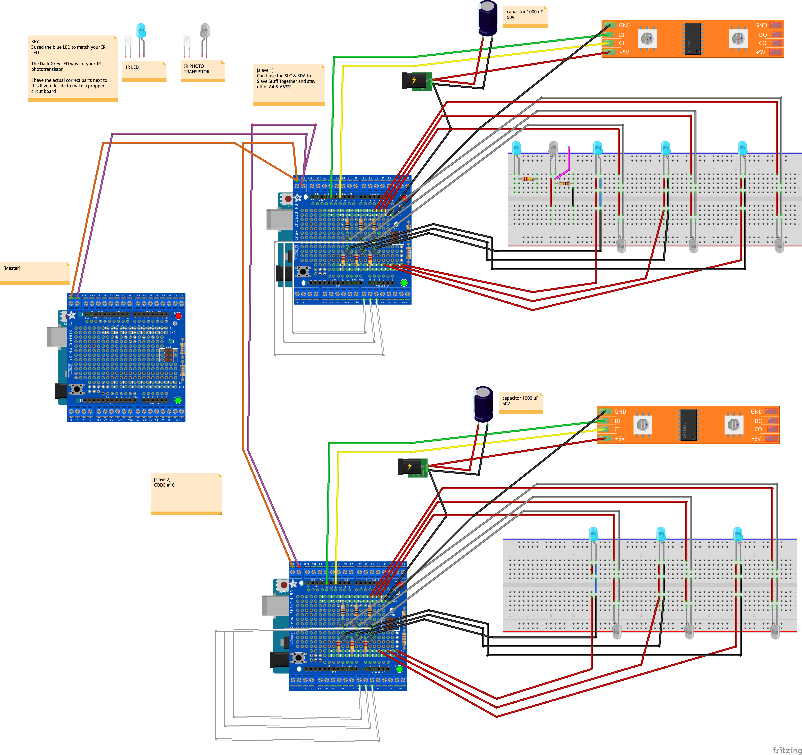
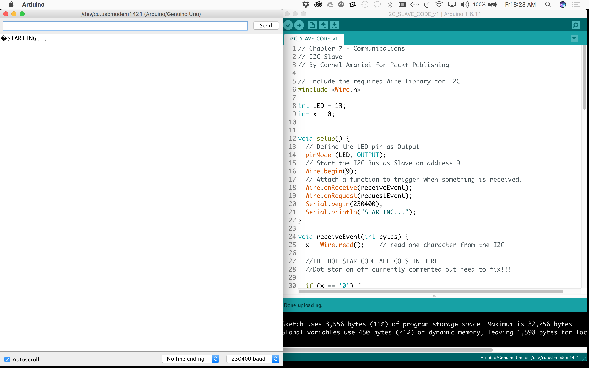
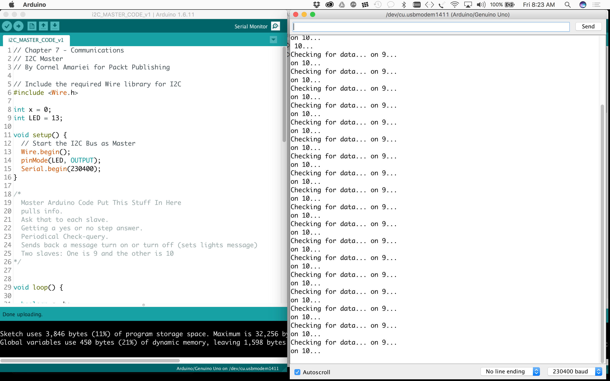

# StairAware: Meditations on Stillness

Stair Aware is a modular light block system powered by Dot Star LED’s that aims to capture a user’s 1D position leveraging infrared light and photo resistors and burst graphics across an LED matrix in the form of circular waves (water ripple emulations) from the position of each foot on a person’s walking path.   

## Summary

The goal of my project stack ranked in order is to first “master” 1D position, specifically where a users foot is on a path of walking. Once that is understood building cool functions of the lights to work off of that understanding. One step further would be to develop an interesting interface that can be updated and changed by the user of the lights. 

Include a discussion how it will be interactive or responsive to the environment.

I need to map the results of environment where light is showing to see ir light and see where a persons foot is. Once the system understands foot position it burst a set of circle that grow in size across a matrix of dot star LED’s and upon ever foot step it continues the animation. 

## Component Parts

This project will be built via stair aware blocks I have already v1 prototyped which I will improve the geometry of. I will try to use a photon if I can get enough inputs to work off of a photon. Otherwise I am going to move over to a bigger board. I need to sort this out by week 2 and I am going to buy into a few different boards arduinos that are internet controlled and photon stuff. 

## Block Diagram Sketch

## Final Block Diagram

## Initial Thoughts on Challenges

A brief discussion of what you anticipate will be the hardest and most time-consuming parts-

I already started working on a project I just wrapped up today where we put these LED’s with a photon off of a sensor. Getting the animation sequences to work and sync to the sensor across the photon weren’t easy. I built the object, because my partner couldn’t so I don’t know all of the code, but I saw how long it took him. However, I have access to all the code and I can at least ask him if I can’t figure it out. So I feel like this gives me at least a leg forward as I can leverage and build upon that code. 

I don’t fully understand matrix yet and I think that will be a challenge to figure out as well as the complex math that goes along with running these animation sequences. Mapping the correct value to to trigger location I don’t think we be too hard, but making sure the values of light in each environment are right each time the product shifts will be perhaps a challenge. 

## Conclusion
In v1 of the slave and master code we were able to get i2c working and communicating. This was a major undertaking. The master was reporting data and the slave was reading the sensors. 

I then uncommented the code in v2 of master and slave that made the dot star work and stopped blinking the on board led. 

Once I wired up the entire board we reached an error.  Those error reports in the serial are noted below.

## Future Work
Next, my intention is to make one stair work with the master and run the dot star, with some ease.

From there I plan to finish wiring up 5 stairs total so I can begin to start creating functions for the light system.

I think that would be the ideal testing kit for working on a code bank to make this a real functioning system that can be actuated by a mobile device and pushing the system to the web. 

## Final States The Serial Monitor

## Final Video of Where the Project Is Now
https://www.dropbox.com/s/2l39omnp0gin327/2017-01-20%2008.24.58.mov?dl=0

## Timeline

- Week 1: 11/7
	•	Write proposal
	•	BOM-By Sunday & Start Ordering
	•	Catalog Out Light Libraries and Patterns
	•	Deeper Detail Of Plan-By Monday Morning

- Week 2: 11/14
	•	Pagoda Development (Work with Dot Star)

- Week 3: 11/21
	•	Product sketches of the final presentation in the gallery
	⁃	What are all the components we need to build for presentation? 
	•	Price out total order of 3D parts from Victif/ Price with Fathom (better options?)
	•	Receive Parts in Mail By End of week
	
- Week 4: 11/28
	•	Assemble out a bigger part of the system and begin to test and refine it
	
- Week 5: 12/5
	•	Wire Up all the proto shields

- Week 6: 12/12

- Present! (12/16-17?)
	•	Layout the Full Schematic of the System by Monday
	•	Go through Pagoda Learnings Code and LED libraries associated with that
	•	I went to the interface show and I brought my media machines game project where I collected some valuable research on how people interact with the platform when there is no screen running the processing animations. 
	•	I also spent a huge amount of time on that game board, which I personally connect to this class and project, though it was being done for another class. 

- Week 7: 1/16-1/20
	•	Open the original test code and review
	•	Design Basic Circuit 
	•	Plan to Wire Up 2 Complete Stairs
	•	Milestones.dig through where everything is at. 
	•	Finish the schematic 
	•	Make sure all the pins get put into the code
	•	Wire Up Slave #9
	•	Get the Dot Star Stuff in the Code
	•	Dot Star Test on Slave 9 on one sensor
	•	If Dot Star Test On Slave 9 Doesn’t Work: isolate the code on the lights and make the led code work stand alone.
	•	Dot Star Slave 9-3 sensors: Uncomment the Other Sensors
	•	Once the Dot Star Stuff Works on #9 
	•	Wire Up Slave #10
	•	Create the code for Slave #10

## References and links
Tutorials, comments, videos, magazine articles - Anything you found that helps you understand your project 
ADVPE Link Pick Up

Written Plans and Sections: 
———————————————————————
Main Wiki-Other Peoples Projects
https://github.com/zamfi/cca-advanced-programming-electronics-fall-2016/wiki

My Final Project Proposal
https://github.com/NathanielCSmith/cca-programming-electronics-fall-2016-monday_FINAL_PROJ_PROPOSAL

My Final Project Proposal Read Me (Fix the Photo)
https://github.com/NathanielCSmith/cca-programming-electronics-fall-2016-monday_FINAL_PROJ_PROPOSAL/edit/master/README.md

Master Project Template
https://github.com/zamfi/cca-programming-electronics-fall-2016-monday/blob/master/project-template.md

JD’s Sample Proposal
https://github.com/zamfi/cca-programming-electronics-fall-2016-monday/blob/master/sample-proposal.md

My Final Stair Aware Proposal?
https://github.com/NathanielCSmith/AdvP-E_Proj_2_StairAware

Early Stage Research: 
———————————————————————

The Work of Jim Campbell
Led Artist That Michael Suggested I Check Out
http://jimcampbell.tv/portfolio/low_resolution_works/a_fire_a_freeway_and_a_walk/

FastLED Animation Library [Main Page]
http://fastled.io/

Arduino – LEDStrip effects for NeoPixel and FastLED
-Tweaking 4 All 
http://www.tweaking4all.com/hardware/arduino/adruino-led-strip-effects/#running_lights

Seed Studio 
(Those People in China Who “Might” Be Able to help Launch This Product)
https://www.seeedstudio.com/

———————————————————————

DROP DOWN RESEARCH WINDOWS TO LEAVE 11/26

Dot Star
https://www.adafruit.com/products/2241

https://learn.adafruit.com/adafruit-dotstar-leds?view=all

Data Sheet
https://cdn-shop.adafruit.com/datasheets/APA102.pdf

Neo Pixel
https://www.adafruit.com/products/1506

Data Sheet
https://cdn-shop.adafruit.com/datasheets/WS2812.pdf

https://cdn-shop.adafruit.com/product-files/1138/SK6812+LED+datasheet+.pdf

Connector
http://www.jst-mfg.com/product/detail_e.php?series=238

Stair Aware Parts List
https://docs.google.com/spreadsheets/d/1P7wKezo04nV9VQVljIbfEDWGtUdUMD_OESBzd4t6Ze0/edit#gid=834867148

I2C between Arduinos
Slave & Master Arduinos
http://www.instructables.com/id/I2C-between-Arduinos/?ALLSTEPS
http://www.instructables.com/id/I2C-between-Arduinos/

AdaFruit Dot Star Strand Test
https://github.com/adafruit/Adafruit_DotStar/blob/master/examples/strandtest/strandtest.ino

AdaFruit Dot Star Matrix code
https://github.com/adafruit/Adafruit_DotStarMatrix/blob/master/Adafruit_DotStarMatrix.cpp

——————————————————————

Tutorials From Michael & JD:

Multi-tasking the Arduino - Part 1
Helpful to not use Delay in Arduino and make classes
https://learn.adafruit.com/multi-tasking-the-arduino-part-1/overview

unsigned long-In Multi Tasking Logic
https://www.arduino.cc/en/Reference/UnsignedLong

Electronic Project Construction Techniques
http://teachmetomake.com/wordpress/construction-techniques#Don8217t_Solder_WIres_to_your_Board_part_2

———————————————————————

Fritzing Section:

Ada Fruit /Fritzing Library
https://github.com/adafruit/Fritzing-Library

Fritzing: Importing Parts
http://fritzing.org/forum/thread/1024/

Fritzing: Making New Parts 1
http://fritzing.org/learning/tutorials/creating-custom-parts/providing-part-graphics/

Fritzing: Making New Parts (Graphic Standards)
http://fritzing.org/fritzings-graphic-standards/

Fritzing: Making New Parts (Help Menu)
file:///Applications/Fritzing.app/Contents/MacOS/help/parts_editor_help.html

Spark Fun Tutorial-Make Your Own Fritzing Parts
https://learn.sparkfun.com/tutorials/make-your-own-fritzing-parts

Spark Fun Fritzing Parts 
From ALL Tutorials-Downloaded
https://github.com/sparkfun/Fritzing_Parts

Raspberry Pi Relay & APA102 LED Controller!
really interesting project. you should circle back on this. It could be valuable to develop the interface for the stairs
https://github.com/plasmadancom/Raspberry-Pi-Relay-APA102-LED-Controller

Fritzing: Make an adaptive part like screw terminal, headers etc..
http://fritzing.org/forum/thread/1332/

Fritzing Site & Blog
http://blog.fritzing.org/2016/06/

———————————————————————

other lights
https://www.alibaba.com/showroom/apa102-144-led-pixel-strip.html

https://www.alibaba.com/product-detail/IP65-waterproof-DC5V-White-PCB-1M_60515556929.html?s=p

Sourcing the fritzing LED light part you need

ras pi tutorial
https://learn.adafruit.com/light-painting-with-raspberry-pi/hardware

forums link
https://forums.adafruit.com/viewtopic.php?f=47&t=76751#wrap

DotStar module for Python on Raspberry Pi
https://github.com/adafruit/Adafruit_DotStar_Pi

Arduino: What Adapter?
http://playground.arduino.cc/Learning/WhatAdapter
